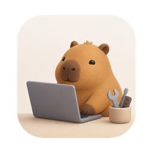

# CapyBuddy

**Your friendly Mac companion — a whole toolbox in your menu bar.**

Screenshot with OCR & translate · Screen recording · Clipboard history · Converters · PDF tools · QR codes · and more

### [⬇️ Download CapyBuddy.dmg](https://github.com/ATLAI-TECH/CapyBuddy-releases/releases/latest/download/CapyBuddy.dmg)

**[🌐 Visit the website → capybuddy.atlai.co.uk](https://capybuddy.atlai.co.uk)**

---

## What's inside

Everything below is **free** — no ads, no account, no subscription.

| Tool | What it does |
|---|---|
| 📸 **Screenshot** | Region capture (⌃1) — annotate, extract text (OCR), translate in place, pin, copy, or save |
| 🎥 **Screen Recording** | Full screen, window, or region to MP4/MOV (⌃2) — pause/resume, system audio & mic |
| 📋 **Clipboard** | Searchable history of everything you copy (⇧⌘V) — text and images, pin favourites |
| 🧰 **Toolbox** | One searchable window with all the small tools below |
| 🔄 **Converters** | Pictures, audio, video, documents & data — PNG, HEIC, MP4, M4A, JSON, CSV and more |
| 📄 **PDF Tools** | Merge, split, images → PDF, PDF → images |
| ✂️ **Video Editor** | Trim, crop, mute, or re-speed a clip right after recording |
| 🗜️ **Compressor** | Zip, tar, tar.gz, gz — compress and extract by drag-and-drop |
| ▦ **QR Code** | Styled QR codes — colours, dot & eye shapes, embedded logo |
| 🔤 **Text Toolkit & Generators** | Case, JSON, Base64, URL, hashes, lines · UUIDs, passwords, timestamps |
| 🗑️ **App Uninstaller** | Remove an app together with its caches, preferences, and leftovers |
| ☕ **Keep Awake** | Stop your Mac from sleeping or dimming |
| 📈 **System Monitor** | Live CPU & memory right in the menu bar |

### ✨ CapyBuddy Pro — £1.99, one-time

One small purchase unlocks the power features, forever (up to 3 Macs, updates included):

- 🔐 **Password Vault** — encrypted KeePass (`.kdbx`) vault with Touch ID unlock and iCloud sync
- 🛡️ **2FA Codes** — time-based one-time codes right next to your passwords
- ␣ **Space Shortcut** — hold Space, tap a key, launch or focus any app
- ⌨️ **Global Toolbox hotkey** (⌃3)

**[Get Pro on the website →](https://capybuddy.atlai.co.uk/#pricing)**

---

## Install

1. **[Download CapyBuddy.dmg](https://github.com/ATLAI-TECH/CapyBuddy-releases/releases/latest/download/CapyBuddy.dmg)**
2. Open it and drag **CapyBuddy** into **Applications**
3. Find the capybara in your menu bar 🎉

Signed & notarized · macOS 15+ · Apple Silicon & Intel · auto-updates via Sparkle
No permission prompts at install — each tool asks only when it actually needs one.

Speaks your language: English · 简体中文 · Deutsch · Français · Español · Русский

## Support & feedback

- 🐛 Bug reports, feature ideas, questions: **[capybuddy.atlai.co.uk/support](https://capybuddy.atlai.co.uk/support.html)** (no GitHub account needed)
- ✉️ Email: [dev@atlai.co.uk](mailto:dev@atlai.co.uk?subject=CapyBuddy%20feedback)

---

This repository hosts release binaries and the Sparkle update feed — the app's source is private. © ATLAI · Made with ❤️ on a Mac · <a href="https://capybuddy.atlai.co.uk/privacy.html">Privacy</a> · <a href="https://capybuddy.atlai.co.uk/terms.html">Terms</a>

